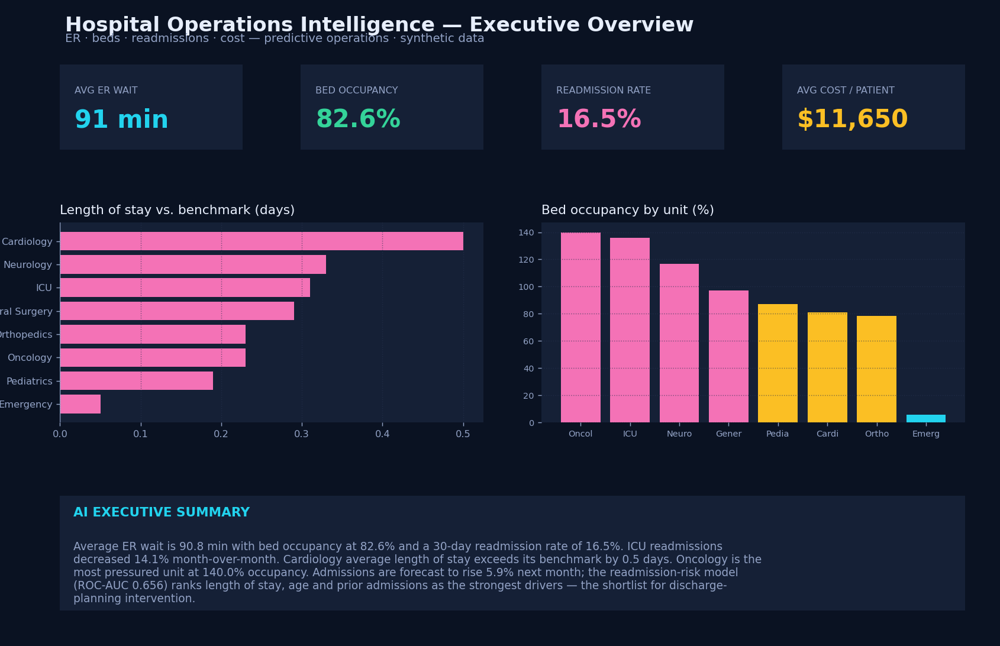

# Hospital Operations Intelligence Platform

An end-to-end analytics platform for hospital operations. It tracks the KPIs that
drive cost and quality — **ER wait times, bed occupancy, 30-day readmissions,
length of stay, cost per patient, and satisfaction** — and **predicts which
patients are most likely to be readmitted** so care teams can intervene at
discharge.

**[▶ Live executive dashboard](https://nagaashrithvollala-ship-it.github.io/hospital-operations-intelligence/)**



---

## What it does

| Layer | What happens |
|-------|--------------|
| **Ingest** | Synthetic encounter-level data (departments, admissions, ER waits, LOS, cost, satisfaction, readmissions, weekly volume) |
| **ETL** | Python loads and types the raw tables into a SQL engine |
| **SQL analytics** | KPI queries: ER wait, occupancy, readmission rate, LOS, cost, department scorecard vs. LOS benchmark |
| **ML** | ① **30-day readmission** classifier ② weekly **admissions forecast** ③ **bed occupancy** by unit |
| **Serve** | Data-driven **AI executive summary** + interactive executive dashboard |

## Architecture

```
  Encounters · Departments · Weekly volume    (raw sources: EHR / ADT extracts)
             │
             ▼
      Python ETL  (pandas)                     src/pipeline.py
             │
             ▼
        SQL engine (SQLite; portable           sql/analytics.sql
        to Postgres / Snowflake)
             │
             ├── KPI queries ───────────────►  metrics.json
             ▼
      ML (scikit-learn)                        readmission · forecast · occupancy
             │
             ▼
   Executive dashboard (Chart.js)              index.html  ← dashboard_data.js
```

## The models

1. **30-day readmission risk** — `GradientBoostingClassifier` on age, acuity,
   prior admissions, length of stay, ER wait and department. Reported with
   held-out ROC-AUC and feature importances; the top-ranked patients are the
   shortlist for discharge-planning intervention.
2. **Admissions forecast** — `LinearRegression` on a weekly time index with month
   seasonality (flu-season winter bump); projects the next 8 weeks.
3. **Bed occupancy** — patient-days ÷ available bed-days per unit, surfacing
   over-capacity departments.

## Key KPIs

Average ER wait · Bed occupancy % · 30-day readmission rate · Average length of
stay · Cost per patient · Patient satisfaction · Department LOS vs. benchmark.

## Project structure

```
hospital-operations-intelligence/
├── index.html            # interactive executive dashboard (Chart.js)
├── dashboard_data.js     # analytics output powering the dashboard
├── metrics.json          # full KPI / model / forecast output
├── dashboard_preview.png # preview image (above)
├── src/pipeline.py       # data gen → ETL → SQL → ML → exports
└── sql/analytics.sql     # named KPI queries (portable SQL)
```

## Run it

```bash
pip install pandas numpy scikit-learn matplotlib
python src/pipeline.py     # regenerates data, metrics and the dashboard feed
# then open index.html
```

## Tech

Python (pandas, scikit-learn, matplotlib) · SQL (SQLite, portable to
Postgres/Snowflake) · JavaScript / Chart.js.

## Data note

All data is **illustrative and generated deterministically** (`numpy` seed = 11).
**No real or restricted datasets (e.g. MIMIC-IV or Medicare claims) are used** —
those require credentialed access and cannot be redistributed. Swap the generator
for real EHR/ADT extracts with the same schema and the pipeline runs unchanged.
